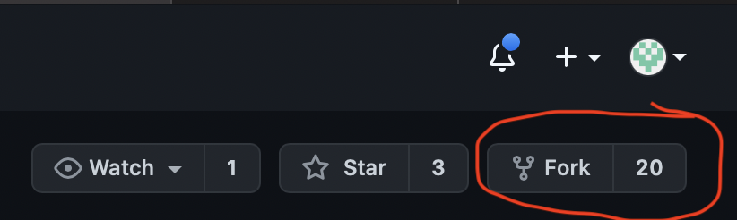
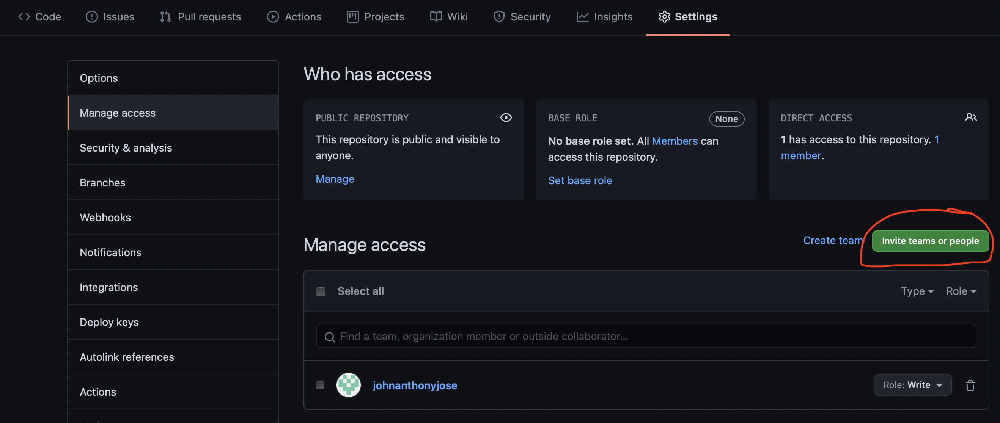

# Git Workshop Exercise

Objectives: Practice the git workflow

## Requirements:
1. Form a group of 2-3
2. Install git on your laptop/PC.
    - For Linux: It's pre-installed

    For Windows: 
    - install [git for windows](https://git-scm.com/download/win)
    - Then, when you need to type git commands, open git terminal (rather than standard command prompt)

    For MacOS, open your terminal, then just follow lines below:
    - Install Xcode command line first, 
    ```bash
    xcode-select --install
    ```
    - Install [Homebrew](https://brew.sh), 
    ```bash
    /bin/bash -c "$(curl -fsSL https://raw.githubusercontent.com/Homebrew/install/HEAD/install.sh)"
    ```
    - then, install git:  
    ```bash
    brew install git
    ```

3. I am giving you access to my team's [Developer's git guide](https://docs.google.com/document/d/1heDkCs0eGNYjyOA3JpF64k3NtwgAFSRxz15CVEvyOaA/edit). It's simple way for you to know what to type in the terminal.


## Getting Started

1. For each group, assign a **maintainer**. Then others would be considered as the **contributors**.

2. The maintainer would fork this repository first. (It's on the upper right beside star) as highlighted on the photo below:
    

3. Add access to your collaborators. Go to settings > Manage Access > Invite team or people. Then type their username


4. For this exercise, make sure that your collaborators have a Role:**Maintain**


## Part 1: Easy collaboration

On your group, assign who would work on the problems:
1. factorial.c
2. fibonacci.c
3. sum.c

Make sure to follow the git workflow. Please check out [Developer's git guide](https://docs.google.com/document/d/1heDkCs0eGNYjyOA3JpF64k3NtwgAFSRxz15CVEvyOaA/edit) to determine what to type on your terminal.

You know that you're done when all of your codes are in the master branch.


## Part 2: Merging new out-of-sync changes

Now, imagine after one week, one of you (contributor X) have formulated a better approach in solving factorial. However, here's the catch: He/she started doing the work when you haven't started Part 1. Therefore, it still doesn't contain the changes you've performed in Part 1. But, you want to merge as it's more efficient (it's in the part2 branch).

Make sure that you have your [Developer's git guide](https://docs.google.com/document/d/1heDkCs0eGNYjyOA3JpF64k3NtwgAFSRxz15CVEvyOaA/edit)

Step 1: Assign someone on who is contributor X. and who is the maintainer.

Step 2: Contributor X would send a pull request.

Step 3: Maintainer would review the code. And See that it is out-of-sync.
    - Maintainer comments out in the conversation to let contributor "rebase"

Step 4: Contributor X would rebase and force push (please check the guide)

Step 5: When it's already in sync, maintainer can comment his approval. Then merge it. (please check the guide)